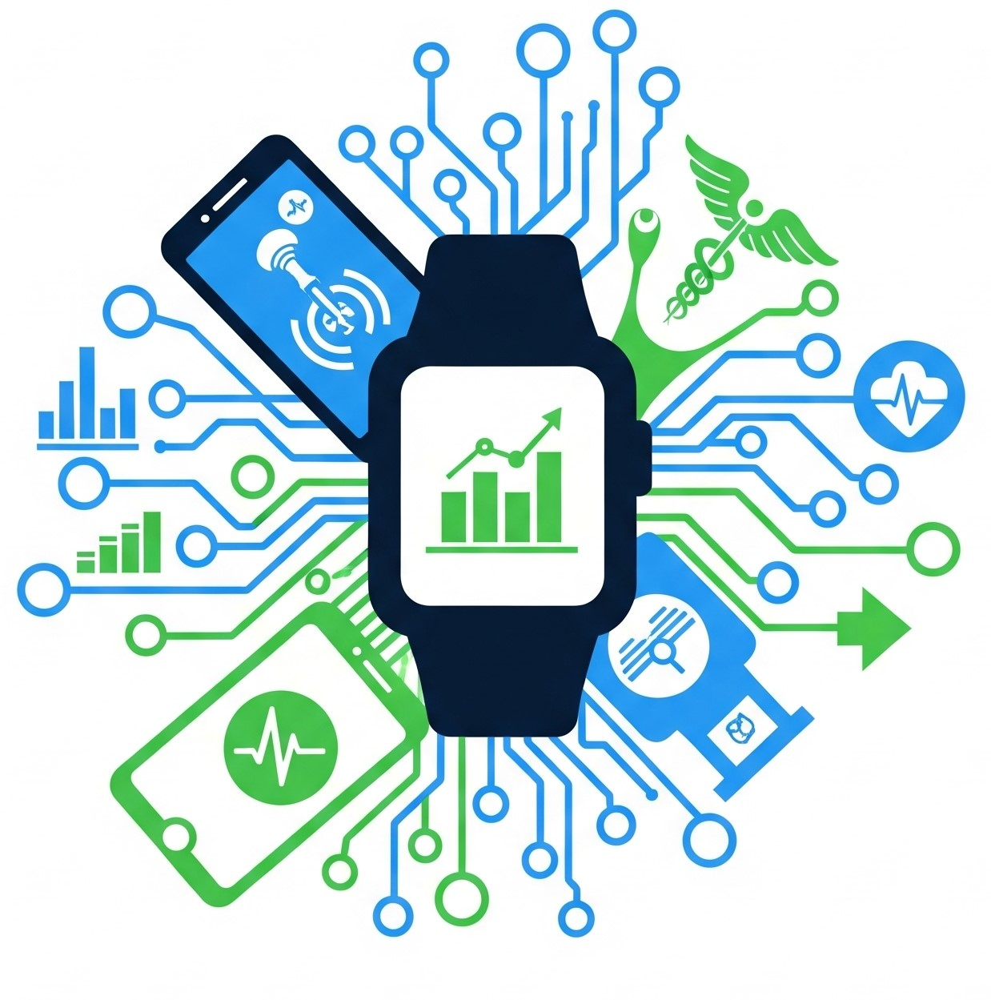

::: {.center}
{width="300"}
:::

## Welcome!

The ASA Mobile and Wearable Data Science Interest Group aims to foster innovation in digital health technologies by promoting cutting-edge methodological research, building community and mentoring relationships, and facilitating knowledge exchange and best practices. 

## News

### JSM Meetings

Join us to discuss the group's goals, structure, and upcoming initiatives. Your input will be invaluable as we shape the future of this interest group.

**Date & Time:** August 2, 2026, at 6:00 PM, followed by informal social hour at 7:00 PM. Westin Boston Seaport District room W-Alcott

